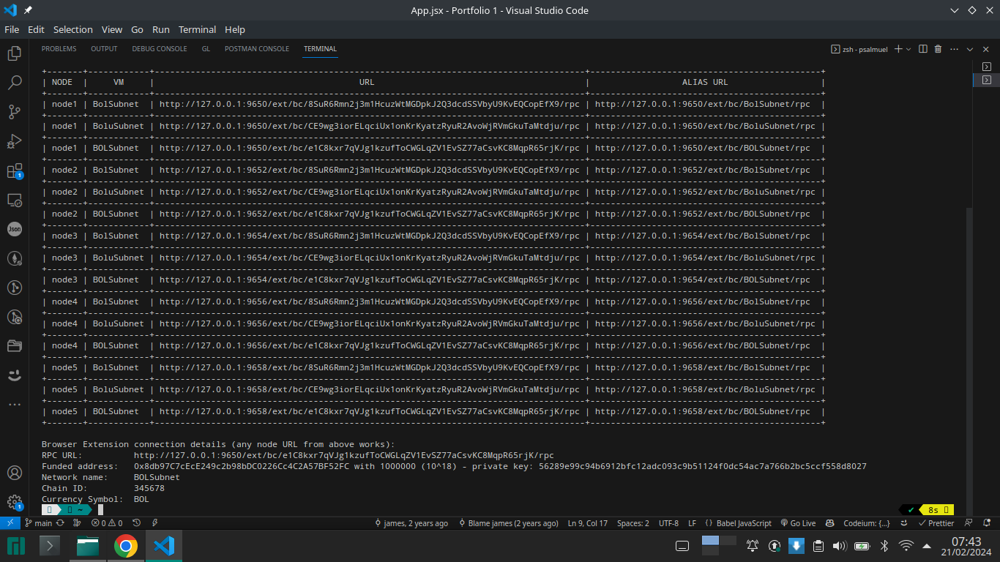
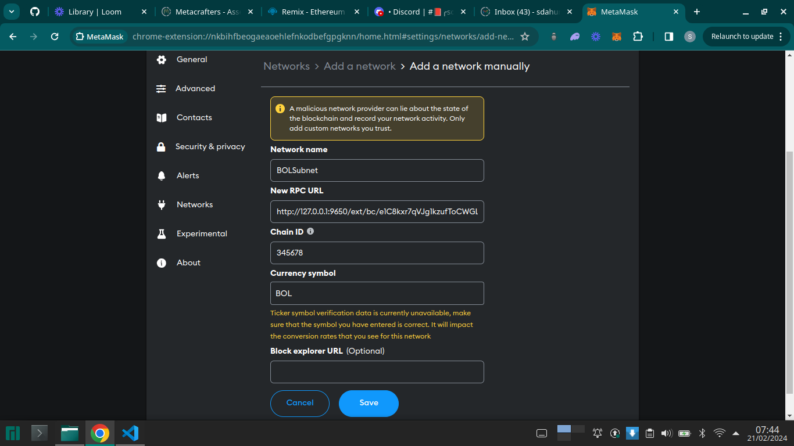
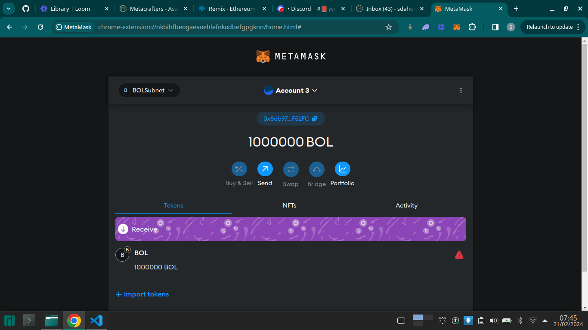

# DeFi Empire

This smart contract allows players to collect, build, and earn rewards for their participation in the game's activities. It has two main contracts, `ERC20 token` contract and the `Vault` contract, which are both deployed on `mySubnet` network.

## Deployed BOLSubnet

## Added BOLSubnet Network to Metamask

## BOLSubnet Details

- `RPC URL`: http://127.0.0.1:9650/ext/bc/e1C8kxr7qVJg1kzufToCHGLqZV1EvSZ77aCsvKC8gpR65rjK/грc

- `Network name`: BOLSubnet

- `Chain Id`: 345678

- `Currency Symbol`: BOL

## Interacted using Remix

### Author

**Bolu Dahunsi**
